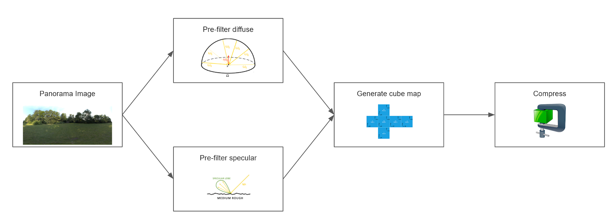

# glTF IBL Sampler

## Introduction

This project pre-filters an environment High Dynamic Range (HDR) panorama image and stores diffuse and specular parts in cube maps respectively. Considering different material characteristics, the specular part consists of several mip-map levels corresponding to different roughness values of the modeled material. The final basis compression into a [KTX2](https://github.com/KhronosGroup/KTX-Software/tree/ktx2) file ensures small file sizes while maintaining reasonable image quality.

Algorithm references:

* [Real Shading in Unreal Engine 4](https://blog.selfshadow.com/publications/s2013-shading-course/karis/s2013_pbs_epic_notes_v2.pdf)
* [GPU-Based Importance Sampling](https://developer.nvidia.com/gpugems/GPUGems3/gpugems3_ch20.html)
* [Runtime Environment Map Filtering for Image Based Lighting](https://placeholderart.wordpress.com/2015/07/28/implementation-notes-runtime-environment-map-filtering-for-image-based-lighting/)
* [Filtering shader](lib/source/shaders/filter.frag)

<!--
The official Khronos [glTF Sample Viewer](https://github.com/KhronosGroup/glTF-Sample-Viewer) is used to clarify, how e.g. a physically-based material has to be lit and rendered. In the [glTF 2.0 reference](https://www.khronos.org/files/gltf20-reference-guide.pdf), the default material model is the Metallic-Roughness-Model. 
-->

## Workflow

The individual transformations can be executed separately in the library, enabling the use of a cube map as input in future releases.  

* Environment HDR image &rightarrow; Cube Map  
* Cube Map &rightarrow; Filtered Cube Map  
* Filtered Cube Map &rightarrow; KTX2 Output File  

This separation of shader passes ensures both, flexibility and extensibility.
The pre-filtering will use the algorithms noted in the [glTF Sample Environments](https://github.com/ux3d/glTF-Sample-Environments) repository.



## Building

The project provides a cmake file to generate respective build files.

Third Party Requirements:

* [Vulkan SDK](https://vulkan.lunarg.com)
* Glslang (included in the Vulkan SDK)
* [STB](https://github.com/nothings/stb) image library (git submodule, no need to install)
* [KTX-Software](https://github.com/KhronosGroup/KTX-Software/releases) (you might need to manually install KTX-Software with the [pull request that fixes cmake find_package](https://github.com/KhronosGroup/KTX-Software/pull/325))

CMake option ```IBLSAMPLER_EXPORT_SHADERS``` can be used to automatically copy the shader folder to the executable folder when generating the project files. By default, shaders will be loaded from their source location in lib/shaders.

The glTF-IBL-Sampler consists of two projects: lib (shared library) and cli (executable). 

## Usage

The CLI takes an environment HDR image as input. The filtered specular and diffuse cube maps can be stored as KTX1 or KTX2 (with basis compression).

* ```-inputPath```: path to panorama image (default) or cube map (if inputIsCubeMap flag ist set)
* ```-outCubeMap```: output path for filtered cube map (default=outputCubeMap.ktx2)
* ```-outLUT```: output path for BRDF LUT (default=outputLUT.png)
* ```-distribution```: NDF to sample (Lambertian, GGX, Charlie)
* ```-sampleCount```: number of samples used for filtering (default = 1024)
* ```-mipLevelCount```: number of mip levels of specular cube map. If omitted, an optimal mipmap level is chosen, based on the input panorama's resolution.
* ```-cubeMapResolution```: resolution of output cube map.  If omitted, an optimal resolution is chosen based on the input panorama's resolution.
* ```-targetFormat```: specify output texture format (R8G8B8A8_UNORM, R16G16B16A16_SFLOAT, R32G32B32A32_SFLOAT)
* ```-lodBias```: level of detail bias applied to filtering (default = 0)

## Example

```
.\cli.exe -inputPath ..\cubemap_in.hdr -outCubeMap ..\..\specular_out.ktx2 -distribution GGX -sampleCount 1024 -targetFormat R16G16B16A16_SFLOAT
.\cli.exe -inputPath ..\cubemap_in.hdr -outCubeMap ..\diffuse_out.ktx2 -distribution Lambertian -sampleCount 1024 -targetFormat R16G16B16A16_SFLOAT
```
